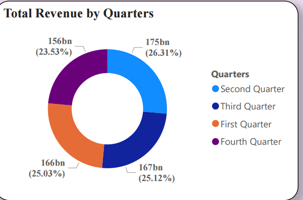

# Sales-Analysis

This PowerBI project involves the analysis of sales data collected from Kaggle. The dataset has undergone thorough data cleaning and preprocessing to ensure the quality and relevance of the insights derived. Below are the steps taken for data cleaning and the subsequent measures and columns created for analysis.

**Data Cleaning and Preprocessing**

The collected sales datasets from Kaggle underwent the following cleaning and preprocessing steps:

Data Collection:
 Collected sales datasets from Kaggle.

Data Combination:
 Combined datasets using join operations to create a unified dataset.

Handling Missing Values: Checked and addressed any missing values in the dataset.

Data Transformation: Transformed data to ensure consistency and adherence to analytical requirements.

**Measures:**

Net Income Measure:

    SUM('World Sales Dataset'[Revenue]) - SUM('World Sales Dataset'[UnitCost])

Offline Customers:

    Var Total_customers = CALCULATE(COUNT('World Sales Dataset'[SalesChannel]))
    Var Offline = Total_customers - [Online Customers]
    Return Offline

Online Customers:

    VAR Online = CALCULATE(COUNT('World Sales Dataset'[SalesChannel]), 'World Sales Dataset'[SalesChannel] = "Online")
Return Online

Total Revenue:

    CALCULATE(SUMX('World Sales Dataset', 'World Sales Dataset'[Revenue]), GROUPBY('World Sales Dataset', 'World Sales Dataset'[Country]))
    

 

**Columns:**

Quarters:

    Var Q1 = 'World Sales Dataset'[Month_ID] in {1,2,3}  
    Var Q2 = 'World Sales Dataset'[Month_ID] in {4,5,6}  
    Var Q3 = 'World Sales Dataset'[Month_ID] in {7,8,9}  
    Var Q4 = 'World Sales Dataset'[Month_ID] in {10,11,12}  
    Return                                                          
    SWITCH(
        TRUE(),
        Q1, "First Quarter", 
        Q2, "Second Quarter", 
        Q3, "Third Quarter", 
        Q4, "Fourth Quarter", 
        ""
    )

Profit Margin:

    DIVIDE([Total Revenue] - [UnitCost], [Total Revenue])

Month_ID:

    MONTH('World Sales Dataset'[ShipDate].[Date])

Running Total Sales:
 
    CALCULATE(SUM('World Sales Dataset'[Revenue]), FILTER(ALLSELECTED('World Sales Dataset'), 'World Sales Dataset'[OrderDate] <= MAX('World Sales Dataset'[OrderDate])))

Shipping_time:

    DATEDIFF('World Sales Dataset'[OrderDate], 'World Sales Dataset'[ShipDate], DAY)

Total_profit:

    'World Sales Dataset'[UnitsSold] * ('World Sales Dataset'[UnitPrice] - 'World Sales Dataset'[UnitCost])

Year(Half):

    SWITCH('World Sales Dataset'[Month_ID], 1, "First Half", 2, "First Half", ..., 12, "Second Half", "")      

    

    

    

